This repository shown the output screenshots for SQL Database Task 1 :

Exercise-1:

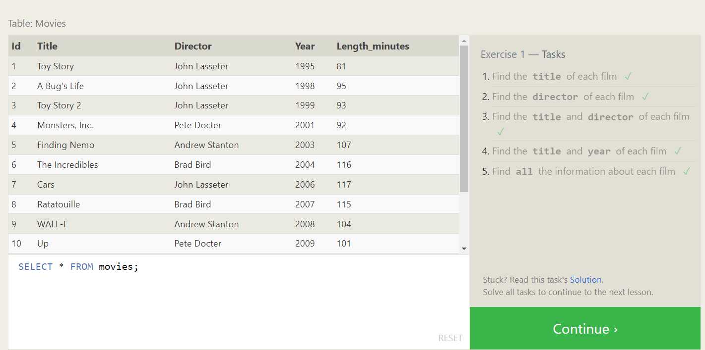

Exercise-2:

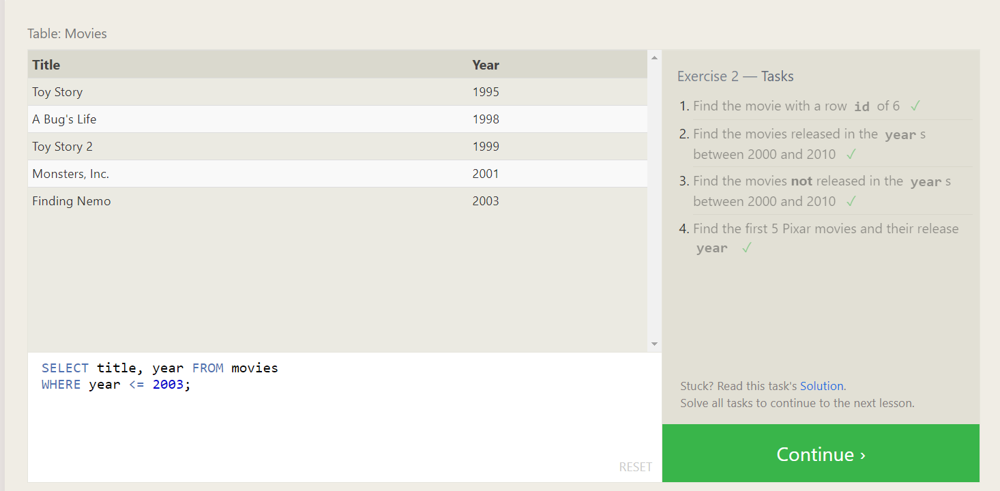

Exercise-3:

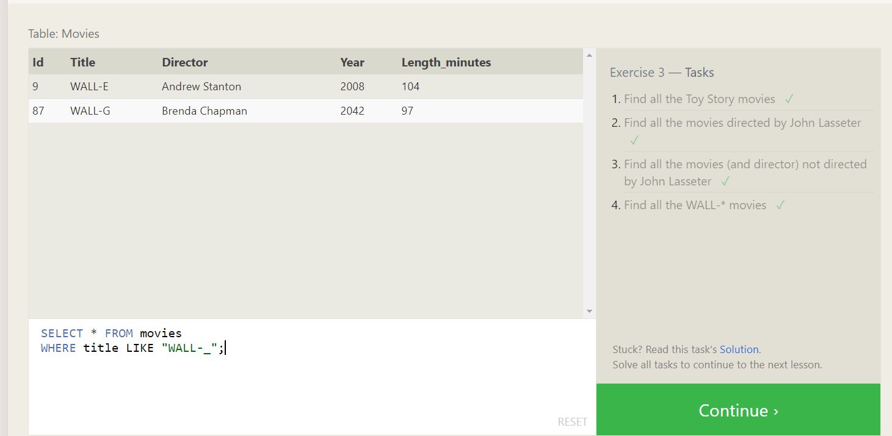

Exercise-4:

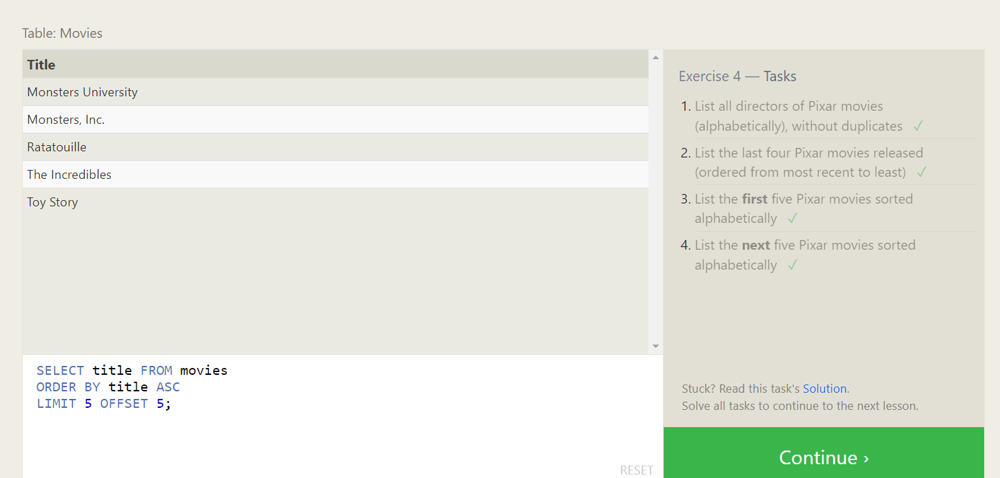

Exercise-5(Review):

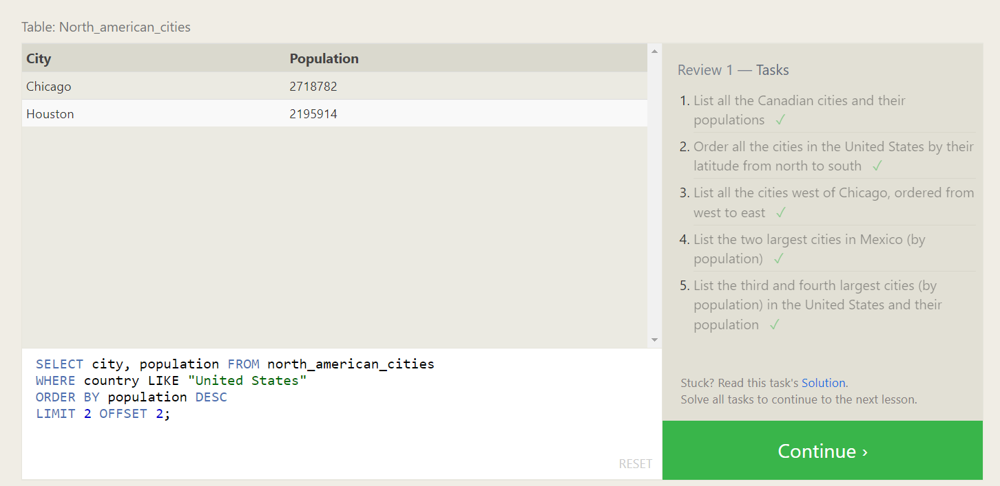

Exercise-6:

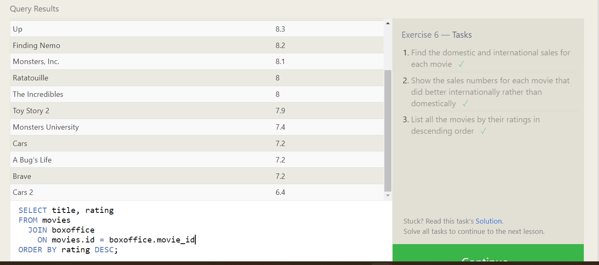

Exercise-7:

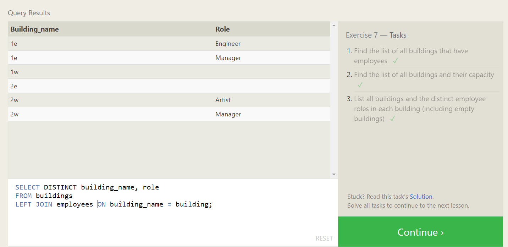

Exercise-8:

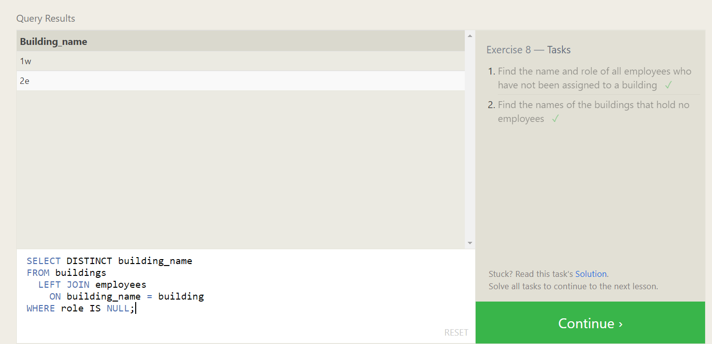

Exercise-9

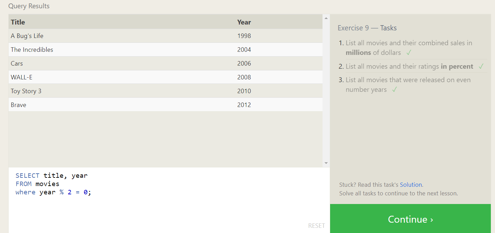

Exercise-10:

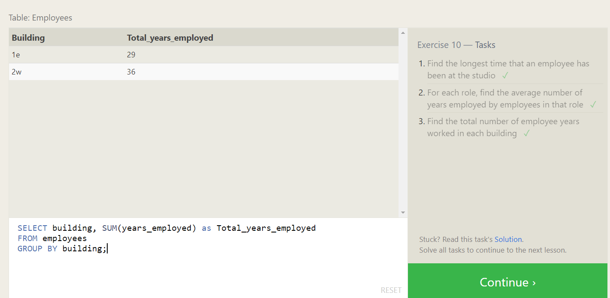

Exercise-11:

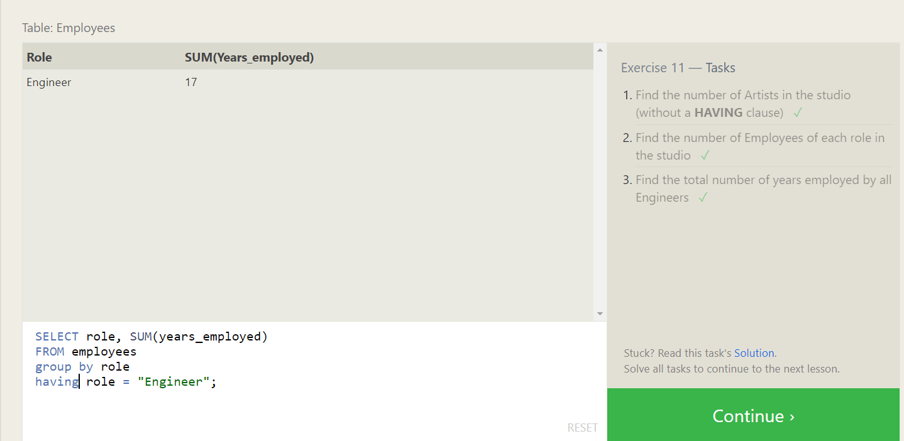

Exercise-12:

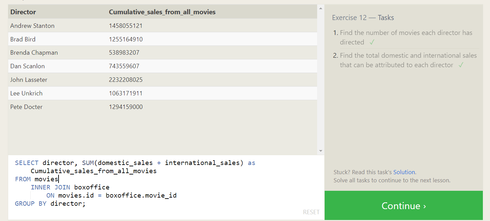

Exercise-13:

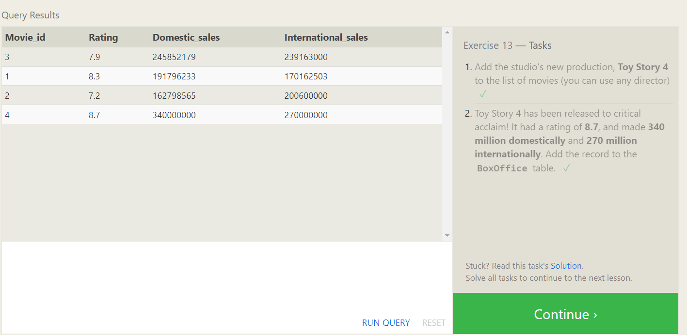

Exercise-14:

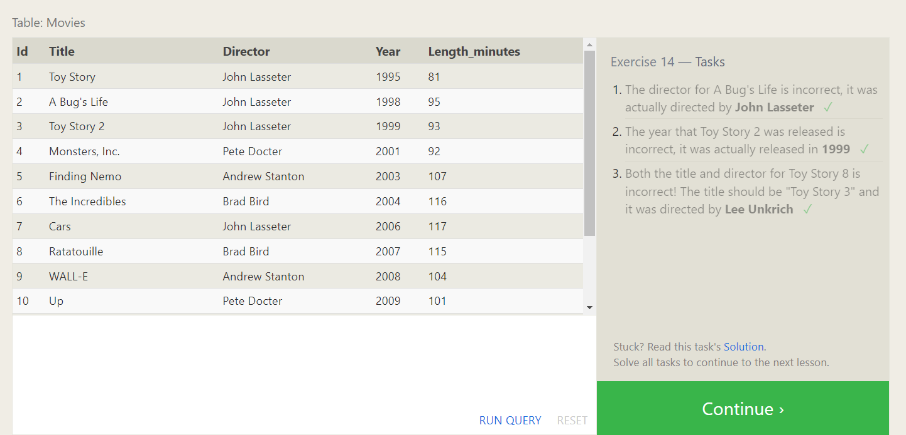

Exercise-15:

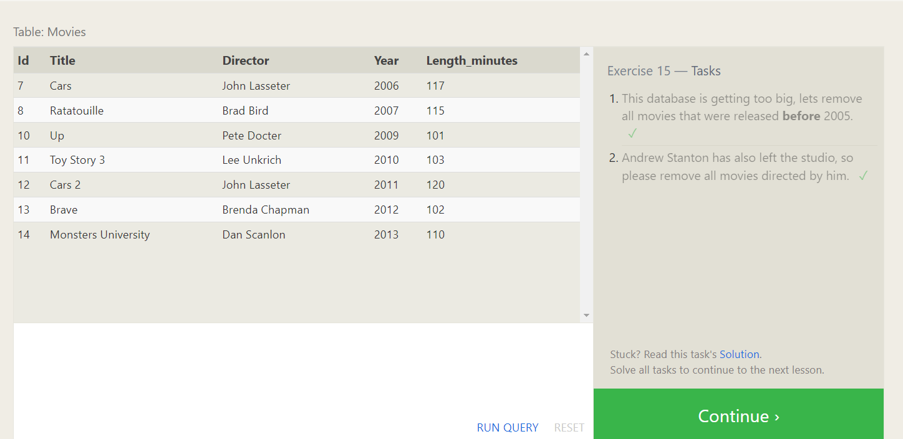

Exercise-16:

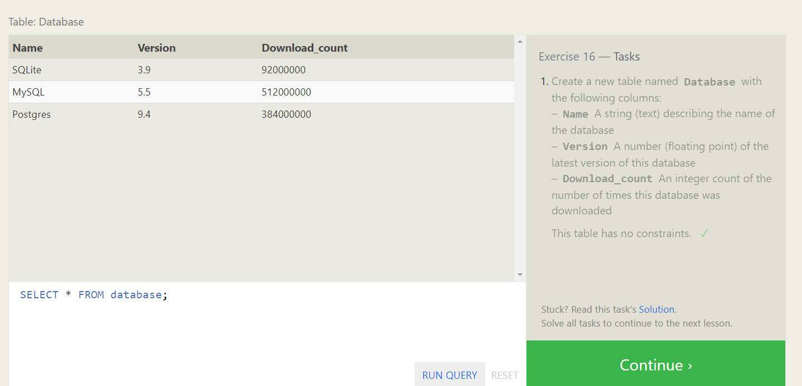

Exercise-17:

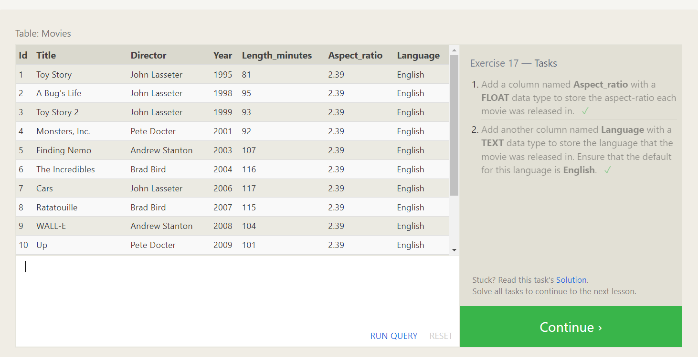

Exercise-18:

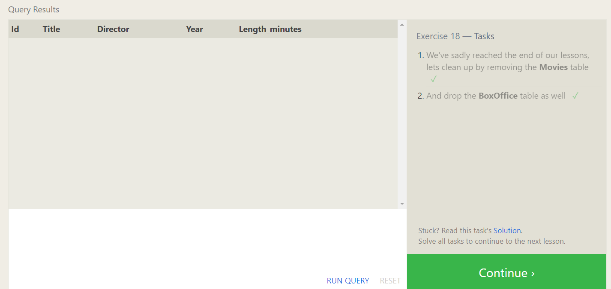

